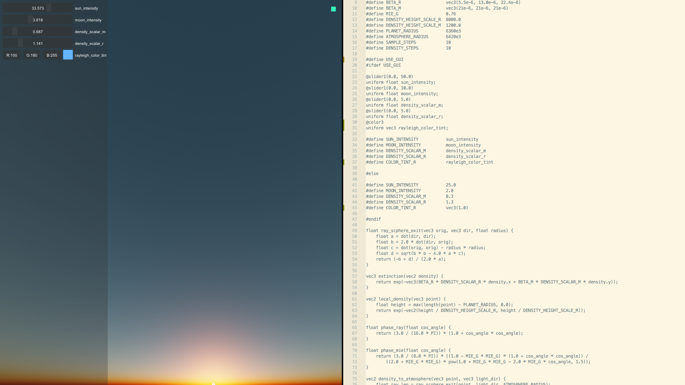

live-glsl
---------

A dynamic and lightweight shader coding tool. It dynamically reloads your shader, does on-screen error reporting and allows for GUI elements to be added from a shader syntax; allowing for uniform value tweaks.



build and run
-------------
```
> cmake . -Bbuild
> cmake --build build
```

```bash
> ./live-glsl.out fragment_shader_to_watch
```

example
-------

To run the example, simply run `./build/live-glsl.out examples/atmosphere.frag` from the main directory after building from sources.

builtin uniforms
----------------
 + time : float
 + resolution : vec2

GUI elements
------------


GUI elements use a specific syntax and should be placed before the uniform statements.
The following GUI elements are supported:

- `slider1`
- `slider2`
- `slider3`
- `slider4`
- `drag1`
- `drag2`
- `drag3`
- `drag4`
- `color3`
- `color4`

The GUI elements should be preceded by an `@` and followed by their component description.
Slider types should be followed by their corresponding `speed`, `min_value` and `max_value`. For example:
```
@slider2(0.1, 0.0, 1.0)
uniform vec2 uniform_name;
```
Drag types should be followed by their corresponding `min_value`, `max_value`. For example:
```
@slider1(-1.0, 1.0)
uniform float uniform_name;
```
